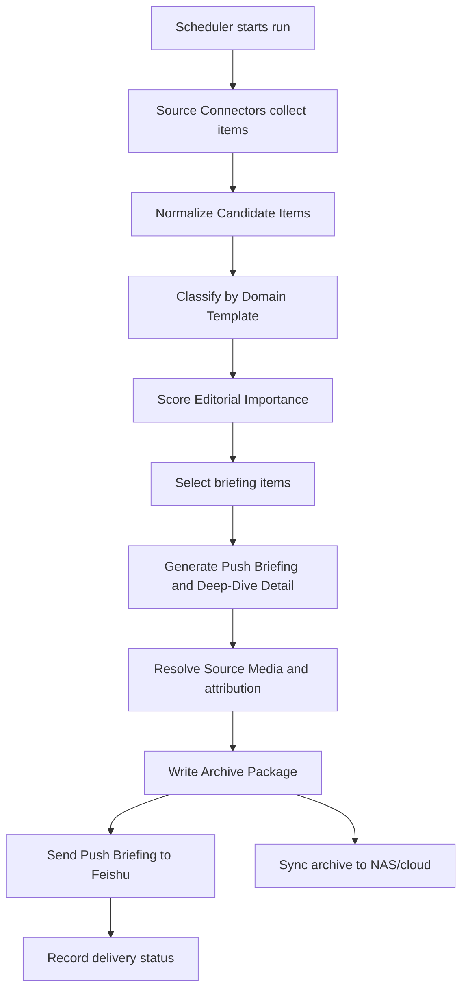

# Architecture Notes

Status: Draft
Last updated: 2026-06-01

These notes describe the first-version system shape. They intentionally avoid locking in a specific framework or database before implementation starts.

## Assumptions

- The application runs on a Briefing Host such as a NAS or always-on small server.
- The system is fully automatic and does not require manual approval before Feishu delivery.
- The Delivery Deadline is more important than complete source coverage.
- The first version optimizes for briefing quality and reliability, not cost control.
- The first version does not store complete source text by default.

## High-Level Components

- Scheduler: starts each Automatic Briefing Run and enforces the Delivery Deadline.
- Source Connectors: collect First-Version Sources and normalize them into Candidate Items.
- Candidate Store: keeps Candidate Item metadata and source references for the current and recent runs.
- Taxonomy Classifier: assigns Candidate Items to Domain Templates, Briefing Sections, and Section Subcategories.
- Editorial Ranker: evaluates Editorial Importance and records Selection Rationales.
- Briefing Generator: creates titles, bullets, summaries, Confidence Notices, and Deep-Dive Details.
- Media Resolver: attaches Source Media and Media Attribution when reliable source media exists.
- Archive Writer: creates the Archive Package and Archive Metadata.
- Feishu Dispatcher: sends the Push Briefing to configured Briefing Recipients.
- Operations Console: lets the Briefing Administrator configure sources, recipients, subscriptions, schedules, and review run status.
- Storage Sync: copies Archive Packages from local storage to the NAS/cloud target.

## Run Flow



## Core Data Concepts

- Source: configured origin for public feeds, academic sources, or manually added URLs.
- Candidate Item: a normalized source item considered for the run.
- Briefing Item: a selected Candidate Item transformed into user-facing briefing content.
- Selection Rationale: explanation of inclusion, exclusion, rank, or confidence state.
- Confidence Notice: visible uncertainty message for lower-confidence pushed items.
- Briefing Recipient: Feishu user or group approved to receive pushes.
- Recipient Subscription: section and subcategory selection for a recipient.
- Archive Package: date-based folder containing readable files, metadata, and media.

## Archive Package Shape

The first-version archive should be easy to browse and easy to process later:

```text
archives/
  2026-06-01/
    technology/
      briefing.html
      briefing.md
      metadata.json
      media/
```

`briefing.html` and `briefing.md` are for human reading. `metadata.json` is for auditability and future indexing. `media/` contains source media or structured visual assets with attribution recorded in metadata.

## Failure Behavior

- If a Source Connector fails, record the failure and continue the run with available Candidate Items.
- If a Source Connector is still running at the Delivery Deadline, send using completed source results.
- If the Model Provider fails for an item, exclude or degrade that item rather than blocking the whole run.
- If media cannot be resolved confidently, send the item without decorative generated art.
- If Feishu delivery fails, record delivery status and make the Archived Briefing available for retry.
- If storage sync fails, keep the local Archive Package and report the sync error in the Operations Console.

## Operations Console

The Operations Console should focus on control and observability:

- Source configuration and connector health.
- Domain Template, Briefing Section, and Section Subcategory management.
- Briefing Recipient approval and Recipient Subscription setup.
- Delivery Deadline configuration.
- Current and historical run status.
- Archive Package links.
- Candidate selection review with Selection Rationales.
- Delivery status and retry entry points.

It should not become a full reading application in the MVP.

## Security and Access

- Protect the Operations Console with a simple Briefing Administrator access mechanism.
- Store Feishu credentials, Model Provider credentials, and storage credentials as secrets outside versioned documents.
- Do not expose archive files publicly by default.
- Treat source links, summaries, and metadata as auditable product data.

## Extension Points

- Deferred Source Connectors can add social media or commercial news APIs later.
- Additional Domain Templates can support political economy or other briefing domains.
- A search index can be added on top of Archive Metadata when historical search becomes important.
- AI chat can later be added on top of archived items and source anchors.
- Cost controls can later use run metadata and model-call logs.
